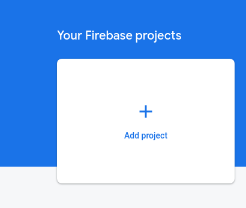
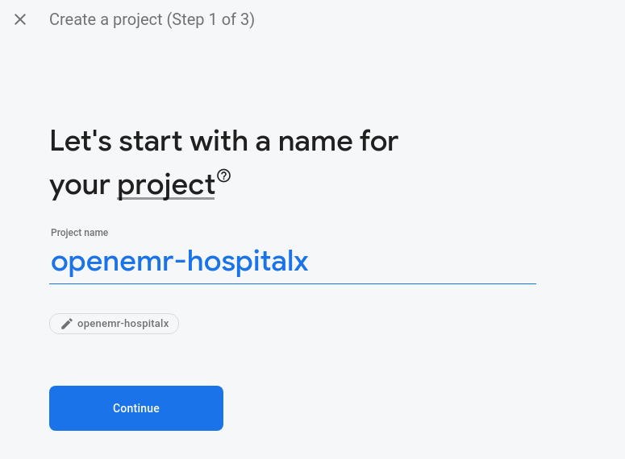
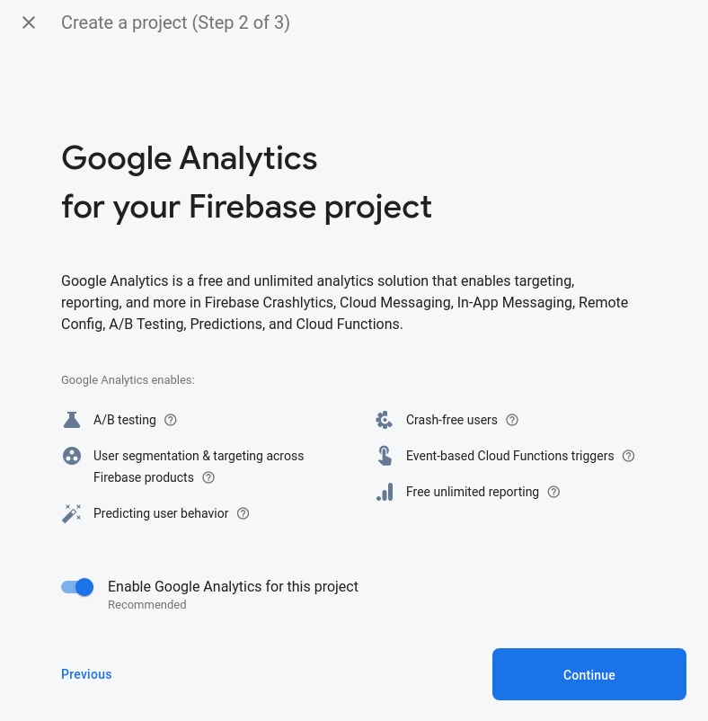
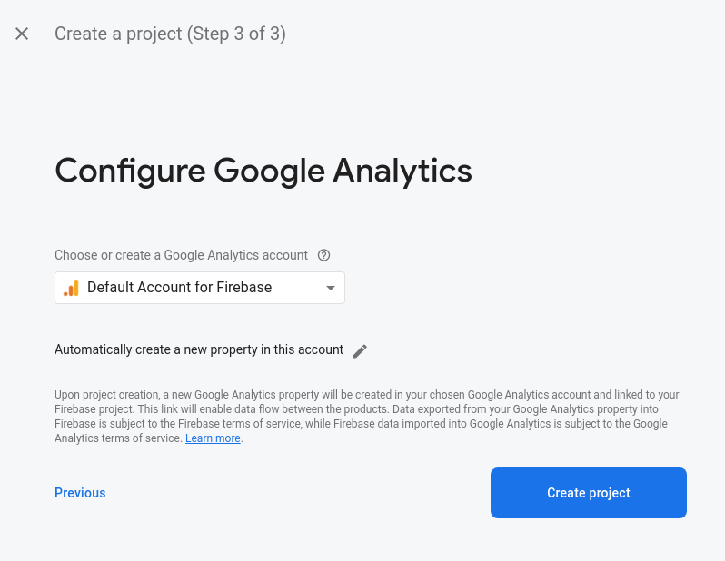
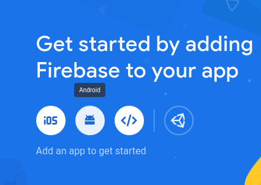
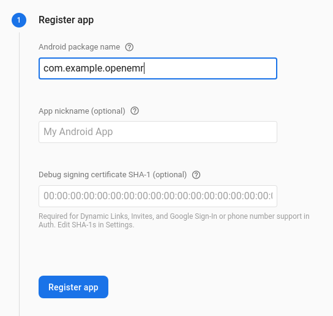
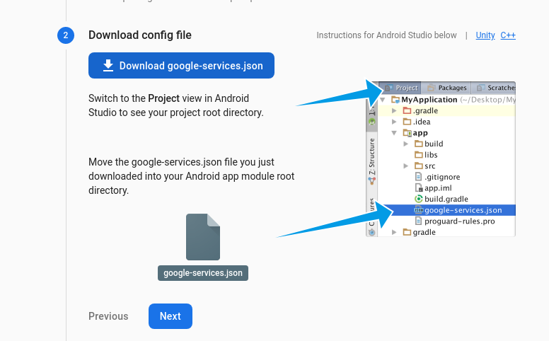
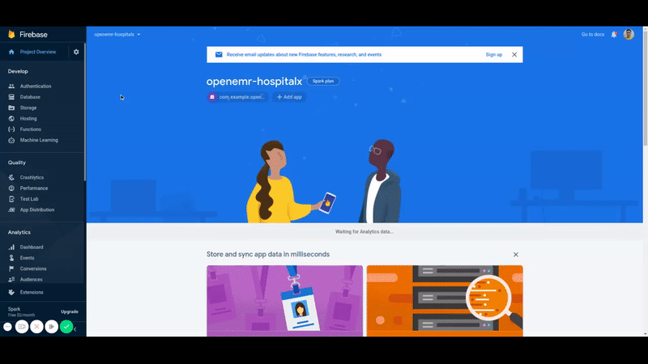
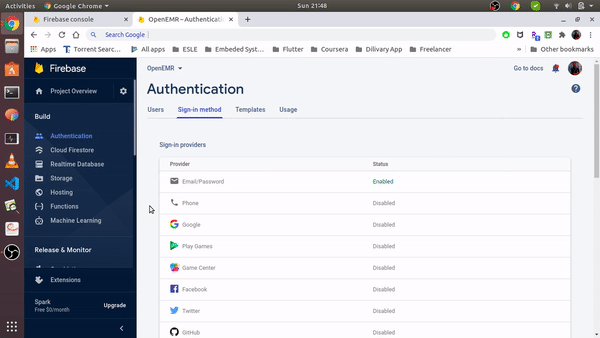
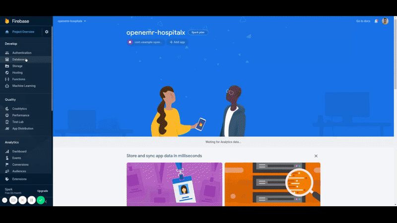

# _Numismatics_
**This is a _Java_ based Android App Project**

## Understanding Numismatics
* Literally _Numismatics_ means study of Money, Keeping up with that, This App would help you manaage all your expenses as well as earnings.
* You can add , edit as well delete any entry.
* You data would be stored in your mobile's Storage.
* You'll be able to some graphical analysis of your expenditure patterns

## Communication
You can ask any query or make any other conversation in the _Numismatics_ channel of [***Opencode***](https://discord.com/invite/PX7uJCSXPw) discord, All useful links and information will be shared on thsi channel only.

### Pre-requisites
* Basic Git and Git-hub 
* Basics of designing layouts using XML
* Java Basics
* Firebase Account

### Setting up project
* Fork this repo to your github account
* Clone it to your local directory
* You can use `git clone <link to the repo>` in the folder you want to clone
* Now, you are good to work on the project
### How to Setup Firebase

#### Project Creation

1. Go to [Firebase console](https://console.firebase.google.com/)
2. Login and click on `Add Project` card  
   
3. Enter desired project name and click on `Continue` button  
   
4. Disable Google Analytics if you want but we suggest you to keep it as it is and click on `Continue` button  
   
5. Select default or desired account and click on `Continue`. (will not appear if you have disabled Google Analytics in previous step)  
   

#### Android - Connection

1. Select `Android` on home-page of your project  
   
2. Enter a `com.example.openemr` as package name. You can checkout this post if you want to [use custom package name](https://medium.com/@skyblazar.cc/how-to-change-the-package-name-of-your-flutter-app-4529e6e6e6fc)  
   
3. Enter the `SHA-1 hash`. [You can get the SHA-1 using this link](https://developers.google.com/android/guides/client-auth)
4. Click on `register app` button
5. Click on `Download google-services.json`. A json file will be downloaded to your desktop.  
   
6. Click on `next` button then again click on `next` button followed by `skip this step` button.
7. Place the `google-services.json` in `android/app` directory.
8. Go to `android/build.gradle` and uncomment `line 12`
9. Go to `android/app/build.gradle` and uncomment `line 26 & 65`

#### Enable Firebase services

1. Authentication(Used for login/register)  
   - Enable Email / Password
   
   - Enable Google   
   
2. Database(Used to store messages)  
   
3. Firestore(Used to store images shared in chat)  
   
